## WebGPU Pathtracer

|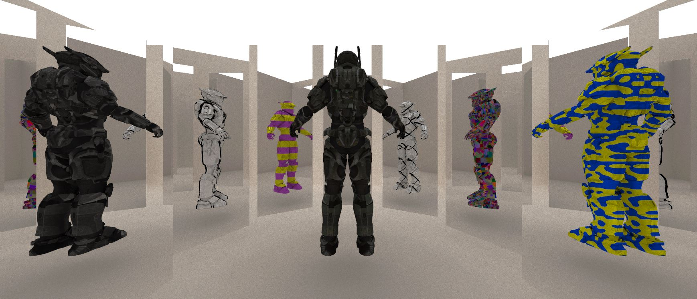|
|:--:|
|Hero's Room|

Authors: 
- Alan Lee ([LinkedIn](https://www.linkedin.com/in/soohyun-alan-lee/), [Portfolio](https://www.alannos.com/))
- Jordan Hochman ([LinkedIn](https://www.linkedin.com/in/jhochman24), [Personal Website](https://jordanh.xyz), [GitHub](https://github.com/JHawk0224))
- Maya Diaz Huizar ([GitHub](https://github.com/Aorus1))

This project showcases a WebGPU pathtracer that supports non-photorealistic rendering techniques and progressive dynamics for cloth simulation based on recent SIGGRAPH papers.

The pathtracer was implemented using primarily wgsl and typescript.

You can directly experience the live demo at our website on [GitHub page](https://alan7996.github.io/WebGPU-NPR/). 

### Live Demo

Click on the image below to test our project on your own browser!

[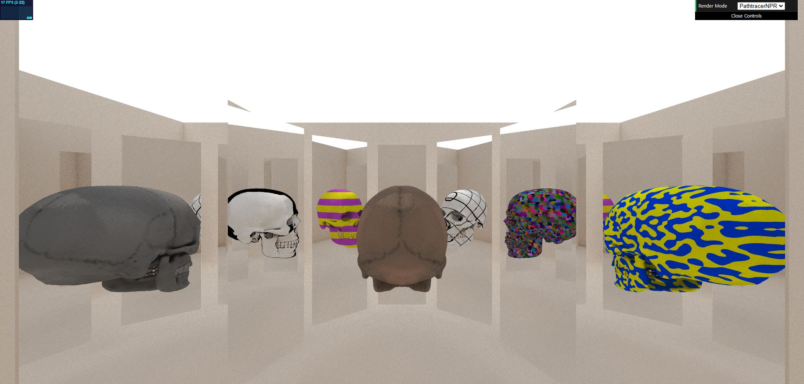](https://alan7996.github.io/WebGPU-NPR/)

## Contents

- `src/` contains all the TypeScript and WGSL code for this project. This contains several subdirectories:
  - `renderers/` defines the different renderers that can be selected. Currently only non-NPR and NPR pathtracers are supported
  - `shaders/` contains the WGSL files that are interpreted as shader programs at runtime, as well as a `shaders.ts` file which preprocesses the shaders
  - `stage/` includes camera controls, scene loading, and cloth loading
- `scenes/` contains all models that can be used in the test scene

## Running the code

Follow these steps to install and view the project:
- Clone this repository
- Download and install [Node.js](https://nodejs.org/en/)
- Run `npm install` in the root directory of this project to download and install dependencies
- Run `npm run dev`, which will open the project in your browser
  - The project will automatically reload when you edit any of the files

## Core Features

### Pathtracer

|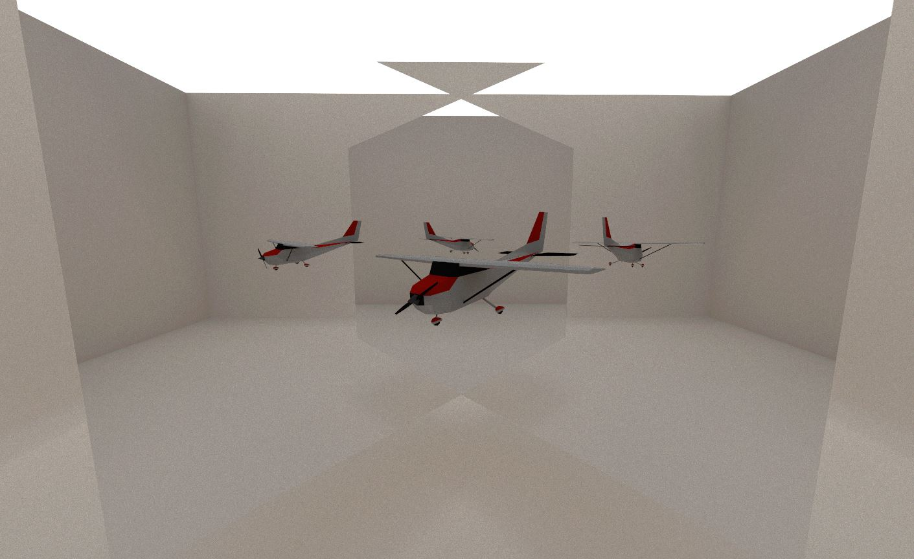|
|:--:|
|Reflections of a Red Airplane|

Our pathtracer consists of multiple compute shader passes and a single WebGPU render pass. For each frame, we 
1. generate camera rays
2. perform ray-scene intersection tests
3. shade materials and compute updated ray direction and albedo for the next ray bounce
4. repeat steps 2 and 3 until either no valid paths remain or maximum ray depth has been reached
5. combine current frame's image with previous frames' accumulated result
6. render latest combination as a render texture

Steps 1 through 5 occur as compute shader passes, and step 6 is a render pass on the triangulated screen-space.

We utilize stochastic sampled anti-aliasing in camera ray generation stage. Ray-scene intersections were accelerated using a bounding volume hierarchy. Rendered frame accumulation resets on any camera movement.

Note that each frame is equivalent to taking a single-sample monte carlo estimate of the rendering equation for the scene. The end result of accumulating indefinitely given absence of camera movement is essentially allowing us to average out N frames of such estimates, leading to a quick and progressive convergence.

### Non-Photorealistic Rendering

|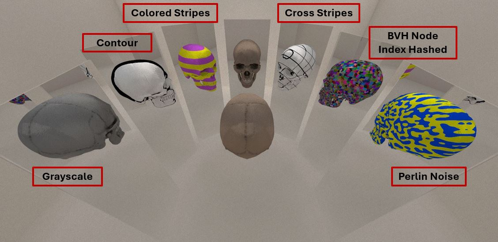|
|:--:|
|Skull Conference|

Our pathtracer supports two rendering modes: regular pathtracer and pathtracer with non-photorealistic rendering (NPR). Based on a [SIGGRAPH 2024 paper](http://cv.rexwe.st/pdf/srfoe.pdf), the NPR mode performs `stylize` function on every material shader invocation.

This renderer is a surface-based renderer (i.e. no volumetric interactions), so we only consider stylization on surfaces. This means we can simply make "style functions" tied to materials interface and properties.

Rex et al. achieves seamless integration of non-photorealistic stylization in a physics-based renderer by using three functions: `shouldStylize`, `requiredSamples`, and `stylize`. This implementation covers `shouldStylize` and `stylize` functions, and `requiredSamples` remains as a future work to be done. This means instead of having a various number of outgoing radiance samples needed for style estimator, we always approximate the outgoing radiance with one sample, similar to our regular pathtracer's behavior.

|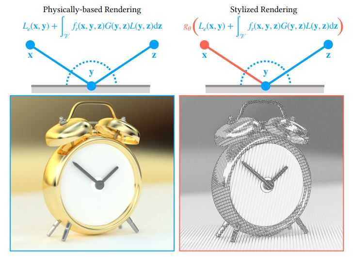|
|:--:|
|Rendering equation as a function of expectation|

`stylize` function is in essence an estimator function that takes in all parameters at a given point of intersection and a) determines if there should be a stylization and b) if so perform the stylization accordingly. This estimation process can be similarly thought of as applying a filter to any region that satisfies predefined conditions. The result is a robust stylization scheme that works in any physics-based environment where we can manipulate stylization on the object itself, reflections, recursive layers of scattering, and so on.

Our implementation defines parameters affecting stylization consideration as `StyleContext` struct given in `common.wgsl`. By default this includes materialId, objectId, path prefix (last object hit), intersection position, intersection surface normal, incoming ray direction, and current intersection's BVH node index. This struct can be easily expanded to include additional parameters such as camera ray direction or parent object's ID that can be used inside the `stylize` function.

Below is an example render where the left and right mirrors only apply grayscale filter on the first bounce to the surface while also discriminating based on which object the ray bounced off of.

|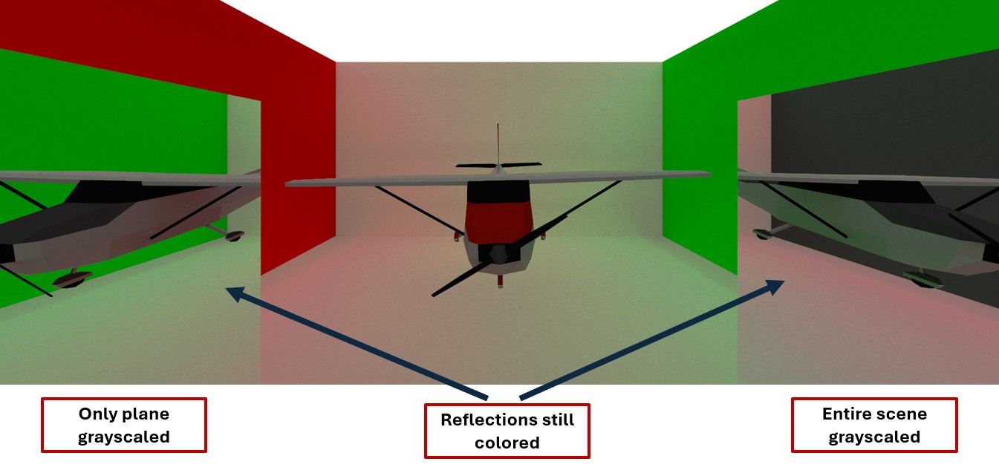|
|:--:|
|Example of stylization depending on path prefixes|

### Cloth Simulation

The cloth simulation runs every set number of pathtracer frames. For example, say every 20 frames, the cloth physics is simulated for a short period of time, and then the pathtracer is resumed to view the new output of the simulation.

Here is an initial image of the cloth simulation with 50 subdivisions along each axis:

|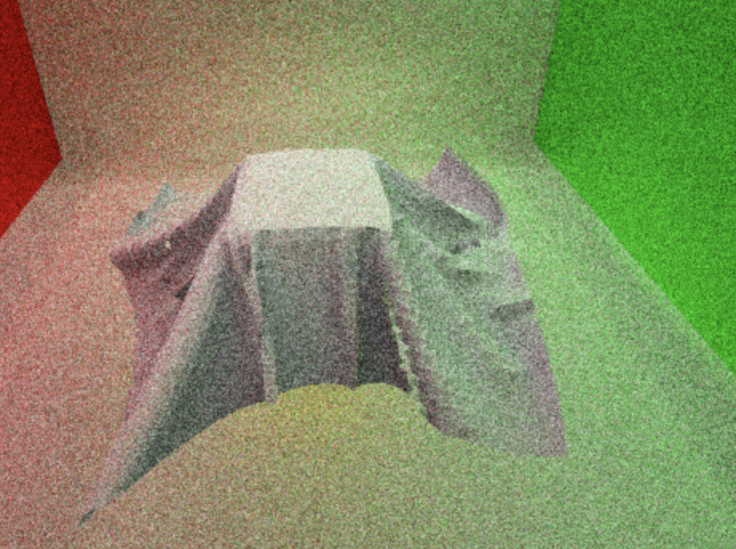|
|:--:|
|Example of Cloth Simulation with 50 Subdivisions|

Notice when we bump up the number of divisions, we can see more fine details. The image below has 500 subdivisions along each axis:

|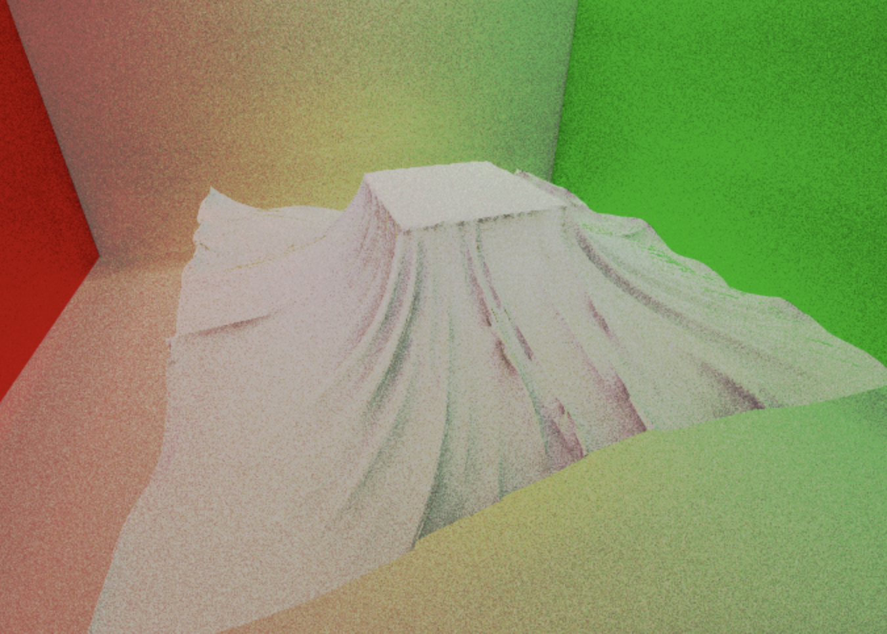|
|:--:|
|Example of Cloth Simulation with 500 Subdivisions|

Additionally, we added an effect similar to wind in the scene to demonstrate the movement of the cloth:

||
|:--:|
|Example of Cloth Simulation with Wind|

## NPR Analysis

* Tested on: **Microsoft Edge Version 131.0.2903.86 (Official build) (64 bit)** on
  Windows 10, AMD Ryzen 5 5600X 6-Core Processor @ 3.70GHz, 32GB RAM, NVIDIA GeForce RTX 3070 Ti (Personal Computer)
* Rendered image size : 1656 x 962 pixels
* Workgroup size : (4, 4, 8)
* Ray depth : 8

The raw data for both qualitative and quantitative observations were made using above testing setup. For the numerical measurements of the performance, please refer to `rawdata.xlsx` at the root of this repository. The render time for each frame was measured in the renderer's `draw` function by taking the difference between recorded timestamps before and after submitting the command encoder to our device queue.

|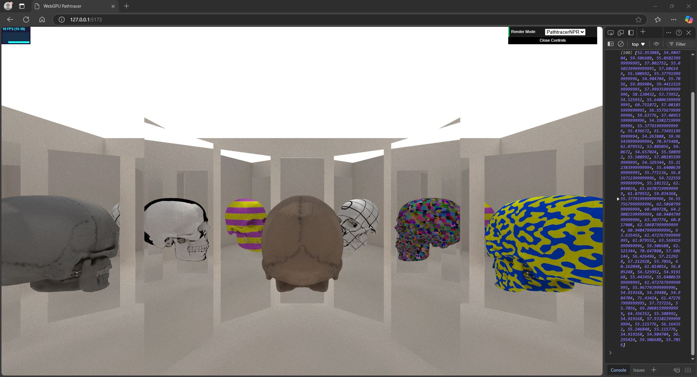|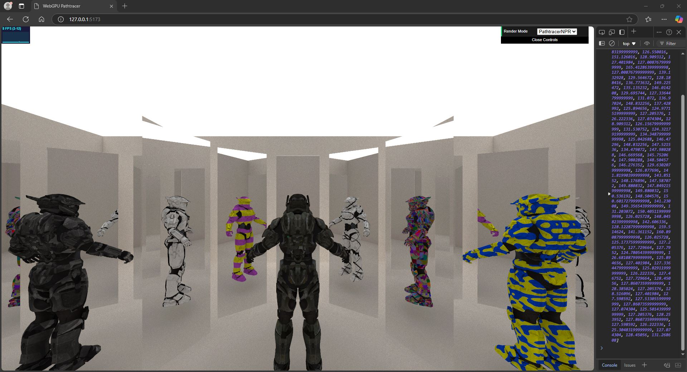|
|:--:|:--:|
|Skull Scene|Halo Spartan Scene|

The performance analysis was conducted using the skull conference scene and the halo spartan scene. Each scene was rendered as 1) without stylization, 2) with only grayscale stylization, and 3) with all stylizations. We tested each configuration by recording render times for **one hundred** frames and averaging the results to reduce the performance effect of any sort of randomness.

|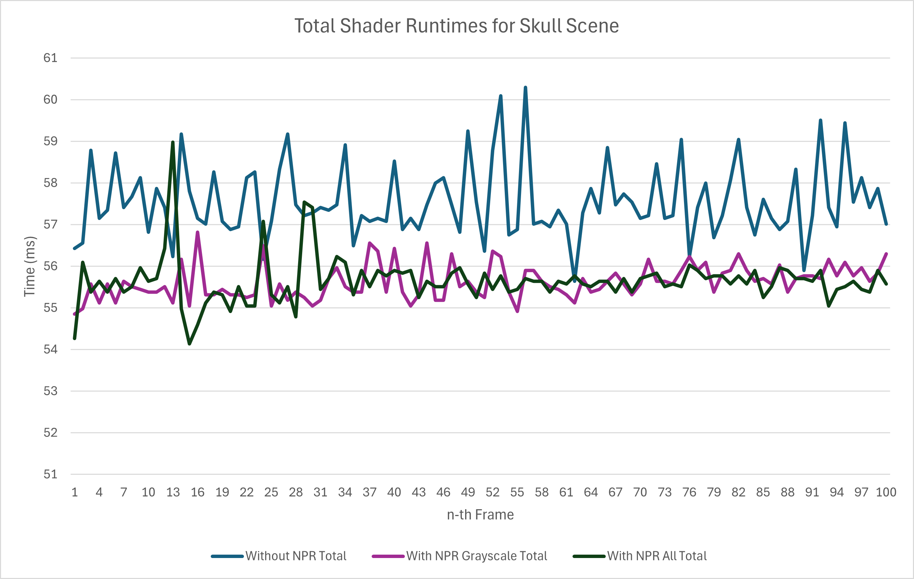|
|:--:|
|Total Shader Runtime for Skull Scene over 100 Frames|

|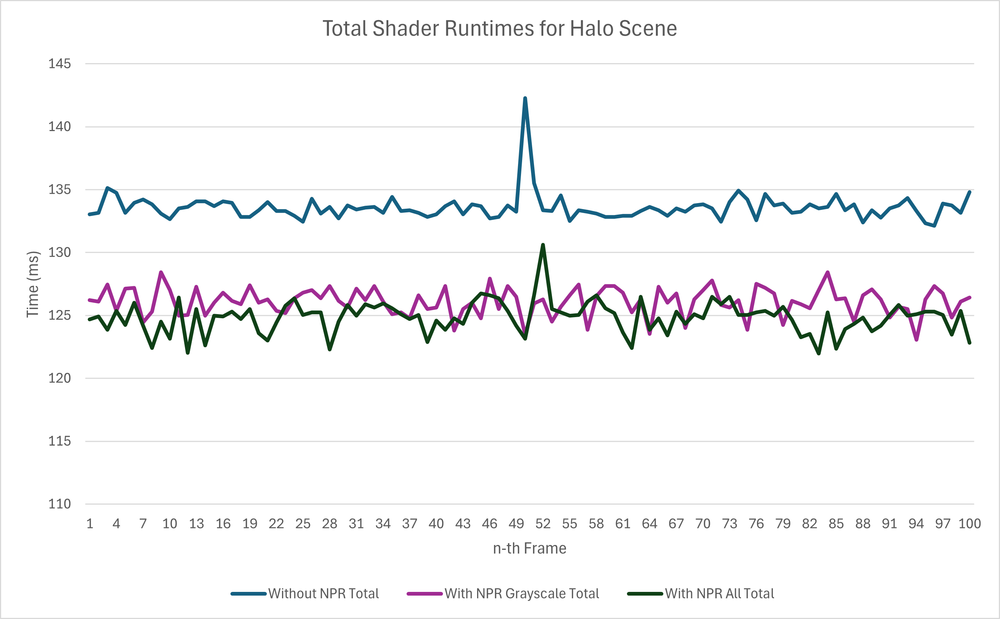|
|:--:|
|Total Shader Runtime for Halo Spartan Scene over 100 Frames|

|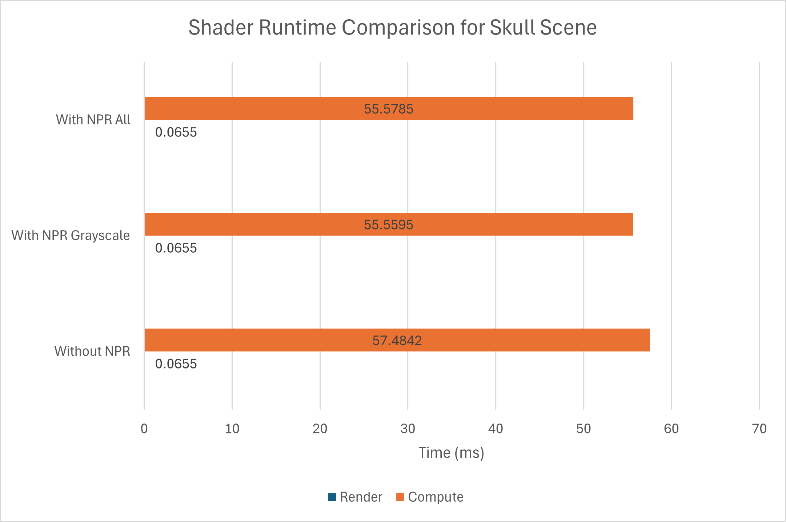|
|:--:|
|Averaged Shader Runtime Breakdown for Skull Scene|

|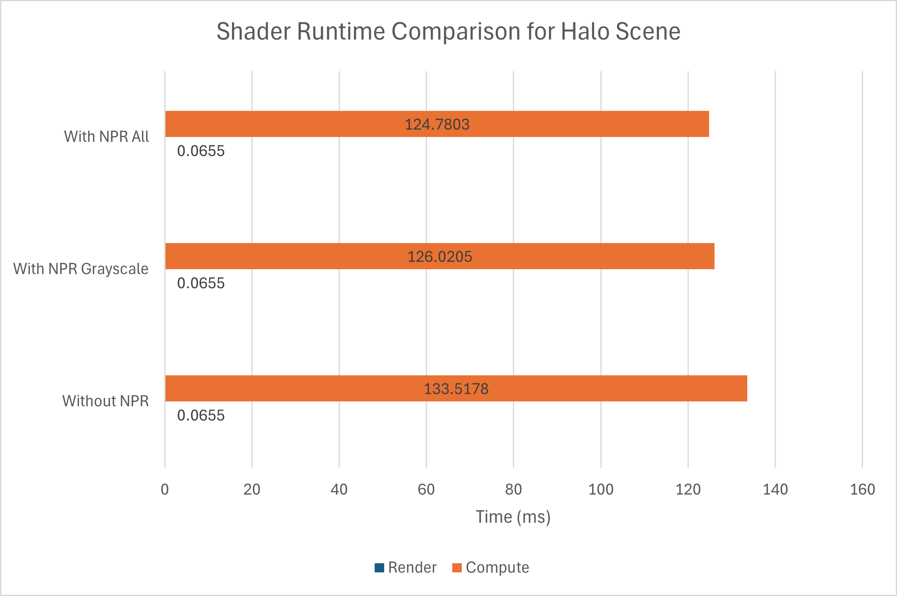|
|:--:|
|Averaged Shader Runtime Breakdown for Halo Spartan Scene|

A very interesting observation emerges from aboves graphs where the renders WITH NPR STYLIZATION ran faster than renders without NPR stylization! The final render passes using accumulated image as the render texture reported all identical runtimes, so this factor will no longer be mentioned as we move on. For the compute passes, the skull scene experienced on average **3.33%** performance increase as we turned on stylization, and the halo spartan scene experienced on average **6.08%** performance increase. This result is very counter intuitive, as we are performing additional operations but we are gaining speed.

To investigate this problem further, we also present a breakdown of each component of the compute shader passes per frame. Since our ray depth is 8, we broke down each ray depth iteration's intersection and material shading into two different passes.

|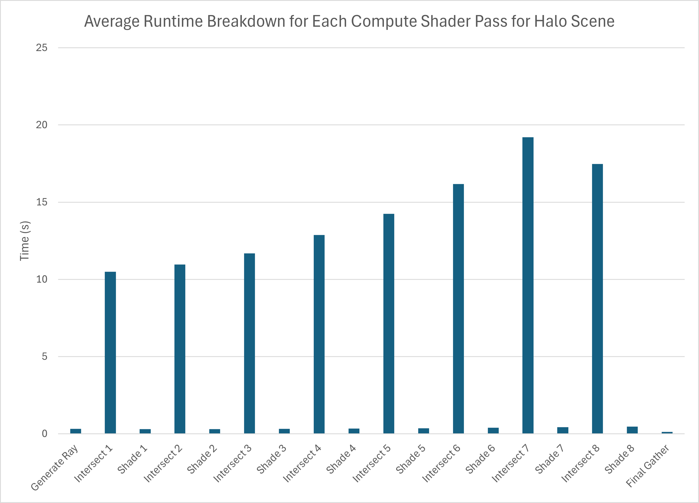|
|:--:|
|Averaged Compute Shader Runtime Breakdown for Halo Spartan Scene|

What we observe above is the fact that ray generation, final gather, and, most importantly, all "shader" kernels had extremely short runtime compared to each intersection test kernels. On average, each shader kernel lasted only **2.61%** of the intersection kernel's runtime. This means that any additional shading operations we perform to stylize objects in the scene only adds onto fractional contributions to this already miniscule runtime.

So this explains why the runtime doesn't increase much compared to renders without stylization, but what explains the decrease in runtime? When rendering a scene without NPR stylization, it turns out to be the case that there is a runtime difference between using the pathtracer mode that doesn't compile stylization shader code together and the NPR pathtracer mode with `shouldStylize` returning always false. The latter reports almost identical times as renders with NPR stylization on, whereas the first reports a significantly slower speed shown in graphs above. Unfortunately we were not able to identify the exact root cause of such difference, so this still remains a future work to be figured out.

## Credits

- [Stylized Rendering as a Function of Expectation (2024)](http://cv.rexwe.st/pdf/srfoe.pdf)
- [Progressive Simulation for Cloth Quasistatics (2023)](https://pcs-sim.github.io/pcs-main.pdf)
- [Progressive Dynamics for Cloth and Shell Animation (2024)](https://pcs-sim.github.io/pd/progressive-dynamics-main.pdf) 

- [Vite](https://vitejs.dev/)
- [loaders.gl](https://loaders.gl/)
- [dat.GUI](https://github.com/dataarts/dat.gui)
- [stats.js](https://github.com/mrdoob/stats.js)
- [wgpu-matrix](https://github.com/greggman/wgpu-matrix)
- [wgpu-basecode](https://github.com/CIS5650-Fall-2024/Project4-WebGPU-Forward-Plus-and-Clustered-Deferred)

- [Halo Spartan Model](https://skfb.ly/6QVvM)
- [Suzanne](https://github.com/KhronosGroup/glTF-Sample-Models/tree/main/2.0/Suzanne)
- [Person](https://poly.pizza/m/qbDLeTtb8K)
- [Skull](https://sketchfab.com/3d-models/skull-downloadable-1a9db900738d44298b0bc59f68123393)
- [Small Airplane](https://poly.pizza/m/7cvx6ex-xfL)
